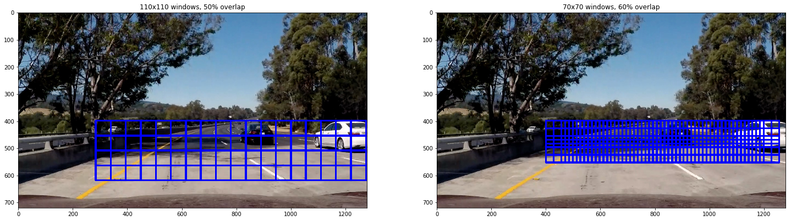

## Vehicle Detection Project

---

The goals / steps of this project are the following:

- Perform a Histogram of Oriented Gradients (HOG) feature extraction on a labeled training set of images and train a classifier Linear SVM classifier.
- Apply a color transform and append binned color features, as well as histograms of color, and combine with HOG features.
- Normalize features and randomize a selection for training and testing.
- Implement a sliding-window technique and use the trained classifier to search for vehicles in images.
- Run the pipeline on a video stream and create a heat map of recurring detections frame by frame to reject outliers and follow detected vehicles.
- Estimate a bounding box for vehicles detected.

The dataset used for this project is the one provided in the lecture notes. It comprises of car images from GTI and KITTI dataset. The test samples for both the classes are balanced.

    There are 8792 car images in the dataset.
    There are 8968 non car images in the dataset.

Following is an exammple of a car image and a not-car iamge from training dataset


---

#### HOG and Color Features

For extracting a set of different features like histograms of color, binning of color and histograms of gradient (HOG), I have implemented a simple class to called `FeatureExtractor()` to store all the parameters for feature extraction pipeline.

The parameters chosen for the Feature Extractor are as below:

```
binSize = (16, 16)
histBins = 16
histRange = (0, 256)
colorspace = "YUV"
orient = 11
pixPerCell = 16
cellPerBlock = 2
hogChannel = "ALL"
```

These are selected while experimeting with the lecture code and yielded ~98.5% accuracy and relatively lesser training time than other combinations. Also, most of the discussions in Udacity forums also suggested these values.

Below is the example of HOG features for all three channels in YUV colorspace


In the next step I created the train/test data to train a Linear SVM model. I also set the C parameter to 10 to reduce false positives. The classifier tends to perform very well on the test split.

    Test Accuracy of SVC = 0.9865

---

#### Sliding Window search

In order detect cars from an image, a sliding window with overlaps is implemented and features are extracted for each of them. I used two sliding windows of different size and different overlapings. An example of each of them is shown below on two test images.





Following are the images on which the detected windows are highlighted for each of the test imaes. It can be noted that the car at position (3, 1) has not been detected. It is strange because I was never able to detect it with many different sliding window parameters. 


---

#### Video Implementation

In order to reduce the false positives and merge the bounding boxes around the vehicles, the heatmap is generated by counting the number of boxes in a region. This is then thresholded to get rid of false positives. Then, the remaining boxes are merged using `label()` function in `scipy`'s image module.

An example of the heatmap and corresponding detections is shown below.


The same detections are shown below on all test images.


Finally, everything is put together to apply on a video file. The video file generated with this approach can be found [here](./project_video_out.mp4).

Furthermore, a python class `Tracker()` is implemented to keep track of the previously found bounding boxes so that the detections are more smooth unlike the video above. The processing pipeline is then redefined to save bounding boxes from last 20 frames and use them to update the heatmap. 

The output generated using this approach can be found [here](./project_video_out_adv.mp4).

---

### Discussion

This project is a great introduction to the state of the art object detection method. A sliding window search implementation is simple yet elegant. But one of the drawbacksof such a method is that there is a great amount of trial and error required to get the pipeline working on a video. Surely, the processing toime can be reduced by selecting a specific region of the image, but it is quite likely to fail in a different environment. Or more importantly, if there are objects of different classes to be detected, then it might pose a constraint to predefine the smaller section of the image. For example, car and airplanes. In such scenarios, the pipeline will be extremely slow as it is notably slow for a single class object detection with a very limited region of sliding windows.

Also, even though the heatmap approach is applied to reduce, false positives, there is still some evidence of false positive detectios in my video pipeline. One of the possible solution to get rid of this is 'hard negative mining' However, as seen from the output video, there is only one specific portion with most false positive detections. And it would not be a great idea to just add a few images to the dataset because of the abundance of other non-car images. Maybe this can be augmented? I am not really sure.

As suggested in the lectures, one of the possible ways to improve the speed is to do HOG subsampling. But tt looks like there is some problem with the understanding of HOG subsampling! There are several discussions on forums too related to this.

Whenever there is an occlusion, this approach fails to identify that occluded vehicle as a seperate vehicle. This is a major limitation as in the situations were there is traffic, this is a very likely scenario.

Moreover, I would say that the approach worked very well in the last decade. This is because recently, there are more robust multi-class object detection models available which leverage Deep Learning. I plan to implement the YOLO model as it is claimed to be the fastest, once I am done with this term.
